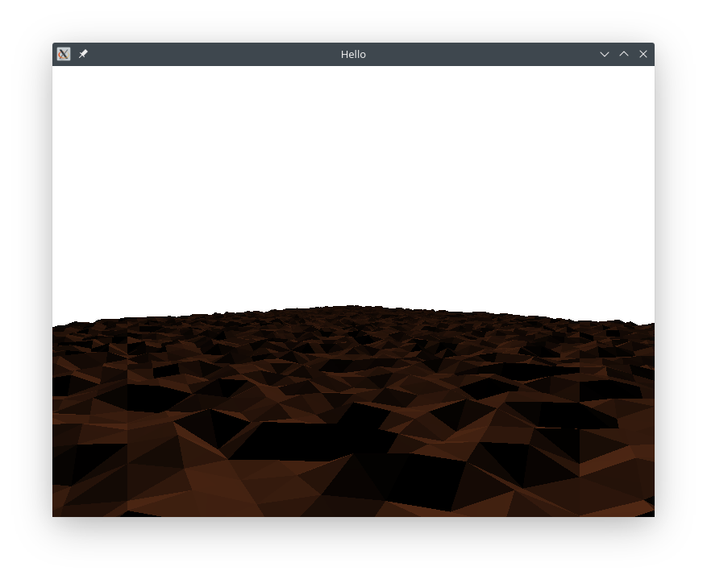

# Things to make:

## Renderer object
### Objects
 - Camera
    - Projection matrix (perspective/orthoganal)
    - View matrix (position/rotation in the world)
 - Object(s)
    - Model matrix (position/scale/rotation in the world)
    - Shader
    - Vertices
### On draw:
   - Reach in and select object model matrix and create mvp matrix
   - Bind the shader used for the object
   - Create the vertex buffer with all required information (position, ect)
   - Draw!

# Todo:
 - [ ] Link shaders with the actual renderer, and objects select what shader to
       use
 - [ ] Implement batch rendering so that any objects that are they same are
       rendered in one call (model matricies passed in to gpu, and ID of the
       matrix is stored in the vertex buffer for each vertex)
 - [ ] Point type
 - [ ] Find new name for vertex array class

# Structure
 - Engine
    - Objects
       - Each object links with a model
       - Contains position, scale, rotation ect ect
    - Models
       - Contains the vertex array object
       - Selects which shader should be used
    - Shaders
       - Loads and compiles shader programs
       - Hashmap with string and program id
    - Cameras
       - List of cameras in the world and their positions
    - Renderer
       - Takes in some objects and a camera and does the rendering

# Resources
 - [Lighting tutorial](https://shader-tutorial.dev/intermediates/lighting/)
 - [Optimising normal calculation](https://www.iquilezles.org/www/articles/normals/normals.htm)
 - [Geometry shader example](https://stackoverflow.com/questions/25434419/glsl-custom-no-interpolation-of-triangles-with-vertex-colors/25508724#25508724)
 - [Shader interface block](https://www.khronos.org/opengl/wiki/Interface_Block_(GLSL))

# Screenshot


```rs

pub struct Cube {
   translation: Vector3,
   rotation: Vector3,
   scale: Vector3,

   shader: &Shader,
   vertex_buffer: VertexBuffer,
   indices: ...
}

impl WorldPosition for Cube {
   fn get_translation(&self) -> &Vector3 {
      &self.translation
   }

   fn get_rotation(&self) -> &Vector3 {
      &self.rotation
   }

   fn get_scale(&self) -> &Vector3 {
      &self.scale
   }
}

impl Movable for Cube {
   fn translate(&mut self, translation: Vector3) {
      self.translation += translation;
   }

   fn rotate(&mut self, rotation: Vector3) {
      self.rotation += rotation;
   }

   fn scale(&mut self, scale: Vector3) {
      self.scale += scale;
   }
}

impl Renderable for Cube {
   fn get_shader(&self) -> &Shader {
      self.shader
   }

   fn get_vertex_buffer(&self) -> &VertexBuffer {
      self.vertex_buffer
   }

   ...
}

```